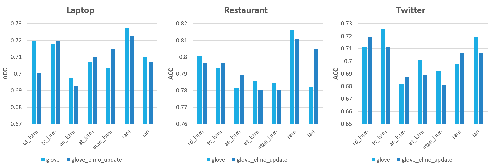

## Aspect-based Sentiment Analysis

Keras implementation (tensorflow backend) of aspect based sentiment analysis

### Models

- [Cabasc, WWW 2018](https://dl.acm.org/citation.cfm?id=3186001)  
Liu et al. "Content Attention Model for Aspect Based Sentiment Analysis"

- [RAM, EMNLP 2017](https://www.aclweb.org/anthology/D17-1047)  
Chen et al. "Recurrent Attention Network on Memory for Aspect Sentiment Analysis"

- [IAN, IJCAI 2017](https://arxiv.org/pdf/1709.00893.pdf)  
Ma ei al. "Interactive Attention Networks for Aspect-Level Sentiment Classification"

- [MemNet, EMNLP 2016](https://arxiv.org/pdf/1605.08900.pdf)  
Tang et al. "Aspect Level Sentiment Classification with Deep Memory Network"

- [ATAE-LSTM(AE-LSTM, AT-LSTM), EMNLP 2016](http://aclweb.org/anthology/D16-1058)  
Wang et al. "Attention-based LSTM for Aspect-level Sentiment Classification"

- [TD-LSTM(TC-LSTM), COLING 2016](https://arxiv.org/pdf/1512.01100)  
Tang et al. "Effective LSTMs for Target-Dependent Sentiment Classification"

### Preprocessing
```
sh preprocess.sh
```

### Training
```
python3 train.py
```

### Environment
- python==3.6.4
- keras==2.2.4
- nltk==3.2.5
- tensorflow=1.6.0

### Data Analysis

see [data_analysis.md](./data_analysis.md)

### Performance
Note: results in the `()` are the performances of models with word embeddings fixed but aspect embeddings fine tuned; results in the `[]`
are the performances of models with noth word embeddings  and aspect embeddings fixed

- Accuracy

| model   | laptop(paper) |  laptop                   | restaurant(paper) | restaurant               | twitter(paper) | twitter                  |
|---------|---------------|---------------------------|-------------------|--------------------------|----------------|--------------------------|
|td_lstm  |               |  0.69905(0.7194)          |                   |  0.7732(0.8008)          |    0.708       |  0.69219(0.7109)         |
|tc_lstm  |               |  0.69122(0.6912)[0.7178]  |                   |  0.7642(0.7696)[0.79375] |    0.715       |  0.71387(0.7124)[0.72543]|
|ae_lstm  |    0.689      |  0.69122(0.6974)[0.69749] |      0.766        |  0.7651(0.7625)[0.78125] |                |  0.68497(0.68641)[0.6820]|
|at_lstm  |               |  0.69122(0.6880)[0.70689] |                   |  0.7678(0.7812)[0.78571] |                |  0.67196(0.7052)[0.70086]|
|atae_lstm|    0.687      |  0.69749(0.6927)[0.70376] |      0.772        |  0.7732(0.7732)[0.78482] |                |  0.66907(0.6965)[0.6921] |
|memnet   |    0.7237     |  0.52821(0.5266)[0.53448] |      0.8095       |  0.6580(0.65)[0.65803]   |                |  0.57369(0.5751)[0.5780] |
|ram      |    0.7449     |  0.70376(0.7225)[0.72727] |      0.8023       |  0.7937(0.8071)[0.81607] |    0.6936      |  0.69653(0.71387)[0.6979]|
|ian      |    0.721      |  0.6865(0.7100)           |      0.786        |  0.7732(0.7821)          |                |  0.68208(0.71965)        |
|cabasc   |    0.7507     |  0.6974(0.6990)[0.67554]  |      0.8089       |  0.7919(0.8080)[0.80357] |    0.7153      |  0.69219(0.69508)[0.6690]|

- Macro-F1

| model   | laptop(paper) |  laptop                   | restaurant(paper) | restaurant               | twitter(paper) | twitter                  |
|---------|---------------|---------------------------|-------------------|--------------------------|----------------|--------------------------|
|td_lstm  |               |  0.64172(0.6636)          |                   |  0.6653(0.6986)          |    0.690       |  0.6746(0.6898)          |
|tc_lstm  |               |  0.62847(0.6335)[0.6666]  |                   |  0.6651(0.6492)[0.70170] |    0.695       |  0.6983(0.6848)[0.7122]  |
|ae_lstm  |               |  0.62486(0.6435)[0.6355]  |                   |  0.6419(0.6370)[0.68319] |                |  0.66644(0.6670)[0.65437]|
|at_lstm  |               |  0.61267(0.6259)[0.65907] |                   |  0.6630(0.6689)[0.6676]  |                |  0.6553(0.68194)[0.6823] |
|atae_lstm|               |  0.6246(0.63185)[0.6539]  |                   |  0.6505(0.6657)[0.68006] |                |  0.6651(0.67400)[0.67085]|
|memnet   |               |  0.38574(0.4118)[0.2322]  |                   |  0.3547(0.4040)[0.3395]  |                |  0.48982(0.49209)[0.4989]|
|ram      |   0.7135      |  0.6474(0.6747)[0.66476]  | 0.7080            |  0.6887(0.7035)[0.72720] |    0.6730      |  0.66536(0.69679)[0.6685]|
|ian      |               |  0.62007(0.6604)          |                   |  0.6550(0.6768)          |                |  0.65071(0.69550)        |
|cabasc   |               |  0.64601(0.6356)[0.5886]  |                   |  0.6815(0.7201)[0.69357] |                |  0.66790(0.67948)[0.6610]|

- Combining with ELMo Embedding

There are 2 ways to use ELMo in this project. Before training model, change the configuration as belows:  
1. In config.py, set `self.use_elmo` to **True** and `self.elmo_hub_url` to **None** or https://tfhub.dev/google/elmo/2. By running train.py the tensorflow hub will download the elmo module and cached in the local temporay directory. But the module will be deleted after a machine reboot.
2. So, I recommend you load the elmo module locally. First, download the elmo using url: https://tfhub.dev/google/elmo/2?tf-hub-format=compressed. Then change its name to **tfhub_elmo_2** (whatever you want), untar the file, and put it in the `raw_data` directory. It will be like:  
     
And don't forget to set `self.use_elmo` in config.py to **True** and `self.elmo_hub_url` to **raw_data/tfhub_elmo_2** (the name you just renamed).  

Here's the results of combining ELMo Embedding:  


- Personal conclusion

1. Surprisingly, I failed to achieved similar performance as stated in the parper of `Memnet`. Or maybe there are bugs in the code?
2. `TD-LSTM` performs unexpectedly well.
3. Models with fixed embeddings are generally better than those with fine-tuned embeddings, which is consistent with the paper of `RAM`.
4. L2 regularization didn't help.
5. I tried elmo embedding, but it didn't bring a performance gain.
